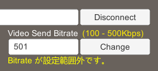

# Video Send Bitrate Sample

## 1. 機能
* Connect 時にVideoの最大送信ビットレートを設定する。
* Connect 後にVideoの最大送信ビットレートを変更する。

## 2. 使用方法
本サンプル使用したビットレートの変更例を以下に示す。

1. `Video Send Bitrate` 入力欄のビットレートに "500" を入力する。  

1. `Connect` ボタンを押下して Connect する。  

1. `Video Send Bitrate` 入力欄のビットレートに "501" を入力する。  

1. `Change` ボタンを押下する。  
サンプルアプリは Client SDK API の `ChangeVideoSendBitrate` メソッドを呼び出し、ビットレートの変更を試みるが、設定値が範囲外（最大値は Connect 時に設定した "500"）のため失敗する。  
また、Client SDK API の `OnError` イベントを受けてエラーメッセージを表示する。  

1. `Video Send Bitrate` 入力欄のビットレートに "100" を入力する。  

1. `Change` ボタンを押下する。  
サンプルアプリは Client SDK API の `ChangeVideoSendBitrate` メソッドを呼び出し、ビットレートの変更に成功する。  

## 3. 参考リンク
Client SDK API の詳細は下記を参照
* [RICOH Live Streaming Client SDK API 外部仕様](https://api.livestreaming.ricoh/document/ricoh-live-streaming-client-sdk-api-%e5%a4%96%e9%83%a8%e4%bb%95%e6%a7%98/)
* [RICOH Live Streaming Client SDK for Windows APIドキュメント](https://github.com/ricoh-live-streaming-api/windows-unity-sdk/tree/main/doc)

## 4. 対応バージョン
* Unity : 2020.3.14f1
* windows-unity-sdk : v1.3.0