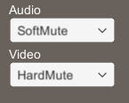
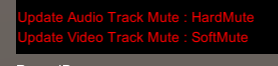

# Mute Sample

## 1. 機能
* 接続相手にミュート状態の更新通知を送信する。
* 接続相手からミュート状態の更新通知を受信する。
  * 映像表示中の接続相手からミュート状態の更新通知を受信した場合のみ、その内容を映像に重ねて表示する。

## 2. 使用方法
2台のPCにて本サンプル使用したミュート状態の更新の例を以下に示す。

* 送信側PC
  1. `Connect` ボタンを押下し、受信側PCと相互配信状態にする。
  1. Audio または Video のミュート状態を変更する。  
     Client SDK API の `ChangeMute` メソッドを呼び出し、受信側PCに Metadata の更新通知を送信する。  

      * 変更画面  
      

* 受信側PC
  1. `Connect` ボタンを押下し、送信側PCと相互配信状態にする。  
  2. 送信側PCからのミュート状態の更新通知を待つ。  
     Client SDK API の `UpdateMute` イベントで受け取った Metadata を映像の左下に赤文字で表示する。  

      * 表示例  
      

## 3. 参考リンク
Client SDK API の詳細は下記を参照
* [RICOH Live Streaming Client SDK API 外部仕様](https://api.livestreaming.ricoh/document/ricoh-live-streaming-client-sdk-api-%e5%a4%96%e9%83%a8%e4%bb%95%e6%a7%98/)
* [RICOH Live Streaming Client SDK for Windows APIドキュメント](https://github.com/ricoh-live-streaming-api/windows-unity-sdk/tree/main/doc)

## 4. 対応バージョン
* Unity : 2020.3.14f1
* windows-unity-sdk : v1.3.0