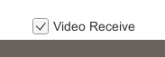

# Selective Sample

## 1. 機能
相手映像の受信の開始/停止を設定する。  

## 2. 使用方法
`Video Receive` チェックボックスON/OFFに応じて、相手映像の受信の開始/停止を設定する。  
チェックボックスのON/OFF変化時は Client SDK API の `ChangeMediaRequirements` メソッドを呼び出す。

  * チェックボックス  
  

## 3. 参考リンク
Client SDK API の詳細は下記を参照
* [RICOH Live Streaming Client SDK API 外部仕様](https://api.livestreaming.ricoh/document/ricoh-live-streaming-client-sdk-api-%e5%a4%96%e9%83%a8%e4%bb%95%e6%a7%98/)
* [RICOH Live Streaming Client SDK for Windows APIドキュメント](https://github.com/ricoh-live-streaming-api/windows-unity-sdk/tree/main/doc)

## 4. 対応バージョン
* Unity : 2021.3.11f1
* windows-unity-sdk : v2.0.0