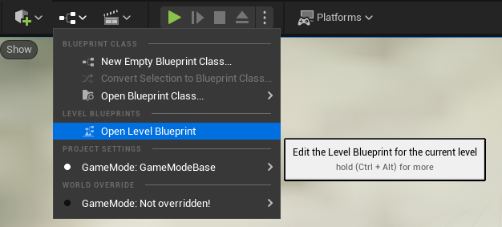
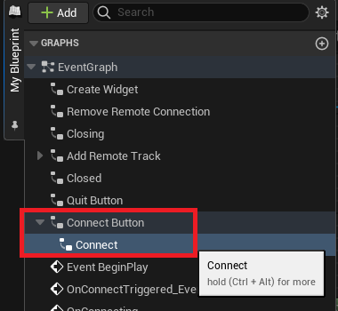
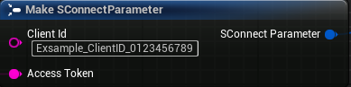
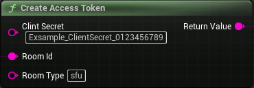
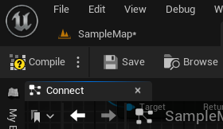
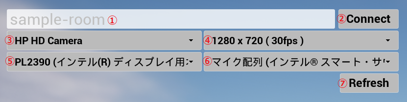

# Windows Unreal Engine 360度映像表示サンプル

RICOH Live Streaming Client SDK for Windows を使用したサンプルアプリケーションです。
RICOH THETA から受信した360度映像を画面出力します。

サービスのご利用には、API利用規約への同意とアカウントの登録、ソフトウェア利用許諾書への同意が必要です。
詳細は下記Webサイトをご確認ください。

* サービスサイト: https://livestreaming.ricoh/
* ソフトウェア開発者向けサイト: https://api.livestreaming.ricoh/
* アカウント登録: https://console.livestreaming.mw.smart-integration.ricoh.com/login/register
* ソフトウェア使用許諾契約書 : [Software License Agreement](../../SoftwareLicenseAgreement.txt)
* NOTICE: This package includes SDK and sample application(s) for "RICOH Live Streaming Service".
At this moment, we provide API license agreement / software license agreement only in Japanese.

## 構成
* [EquirectangularView.uproject](EquirectangularView.uproject) : 本サンプルアプリの Unreal Engine プロジェクト
* [Config](Config) : プロジェクト設定
* [Content](Content) : プロジェクトで使用する BluePrint、テクスチャ、モデルデータ等
  * [BluePrints](Content/BluePrints)
    * BP_AudioInputDevice : オーディオ入力デバイスの取得処理
    * BP_AudioOutputDevice : オーディオ出力デバイスの取得処理
    * BP_SampleClient : Client SDK の API の実装例（接続、切断、イベント処理等）
    * BP_SampleRenderer : 映像描画処理の実装例
    * BP_StreamingWidget : UIの実装例
    * BP_VideoCapability : ビデオキャプチャデバイスの解像度・フレームレートの取得処理
    * BP_VideoCapturerDevice : ビデオキャプチャデバイスの取得処理
* [Source](Source) : 本サンプルアプリのソースコード一式
* README.md : 本ファイル

## ビルド・パッケージ化方法
1. `EquirectangularView.uproject` を右クリックし、「Generate Visual Studio project files」 をクリックする。
2. 上記1.の手順によって生成された `EquirectangularView.sln` を開き、Visual Studio を起動する。
3. Visual Studio のメニューの 「ビルド」 > 「ソリューションのビルド」 を実行し、サンプルアプリをビルドする。
4. `EquirectangularView.uproject` を開き、Unreal Editor を起動する。
5. Level Blueprint の 「EventGraph」>「Connect Button」の `Connect` ノードを開き、Client ID と Client Secret を設定する。

  - Level Blueptint  
    

  - Connect ノード  
    

  - Client ID  
    

  - Client Secret  
  

6. Unreal Editor のメニューの `Compile` および `Save` を押下し、Level Blueprint を保存する。  
  

7. 「Platforms」 > 「Windows」 > 「Packate Project」 を選択し、任意のフォルダにパッケージ化したサンプルアプリを出力する。  
  

## 実行方法
パッケージ化で生成された `EquirectangularView/Windows` フォルダ配下の `EquirectangularView.exe` を実行する。

## 操作説明

|  No.  | 機能                     | 説明                                                               |
| :---: | ------------------------ | ------------------------------------------------------------------ |
|   1   | Room ID                  | 接続時に使用する Room ID                                           |
|   2   | Connect ボタン           | Room への接続および切断を行う                                      |
|   3   | カメラ選択               | 自身の映像送信に使用するカメラを切り替える                         |
|   4   | 解像度 / Frame rate 選択 | 自身の映像送信に使用する解像度・Frame rate(fps) を切り替える       |
|   5   | スピーカー選択           | 相手の音声出力に使用するスピーカーを切り替える                     |
|   6   | マイク選択               | 自身の音声送信に使用するマイクを切り替える                         |
|   7   | デバイス更新             | カメラ、マイク、スピーカーを検出し、ドロップダウンリストに表示する |

- Room 切断状態で Connect ボタンを押下した場合、Room ID で指定した Room に接続する。
- RICOH THETA が同一 Room に接続した場合、360度映像（Equirectangular 形式）を表示する。
- RICOH THETA 以外が同一 Room に接続した場合、平面映像を表示する。
- 本サンプルアプリでは、複数の接続相手の映像を同時に表示することは不可。先に接続された相手の映像が優先される。  
  別の接続相手の映像を表示したい場合、一旦全ての接続相手を切断し、表示したい相手を再接続する必要がある。
- Room に接続中は、選択中のカメラ・マイクを使用して自身の映像および音声を送信する。
- Room 接続状態で Disconnect ボタンを押下した場合、Room を切断する。

## 対応バージョン
* Unreal Engine : 5.1
* windows-unity-sdk : 2.0.0