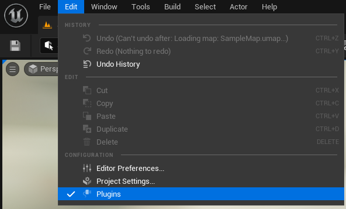
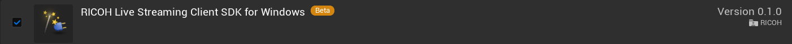
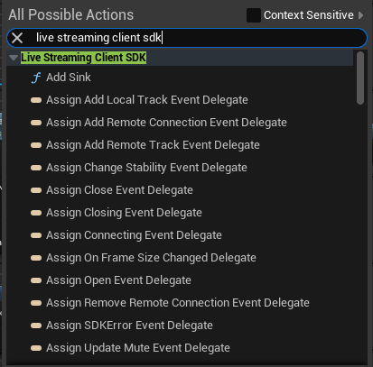

# RICOH Live Streaming Client SDK for Windows Unreal Engine プラグインの利用方法

この文書では、Unreal Engine のプロジェクトで RICOH Live Streaming Client SDK for Windows Unreal Engine プラグイン （以下プラグインと表記）を利用する方法を説明します。

## フォルダ・ファイル構成

```
プロジェクト名
├─ [プロジェクト名].uproject ★プロジェクトファイル
├─ Config
├─ Content
└─ Source
   └─ プロジェクト名
      └─ [プロジェクト名].Build.cs ★ビルド設定
```

## プラグイン準備

1. プラグインのインストール
    1. Unreal Engine の [マーケットプレイス](https://www.unrealengine.com/marketplace/ja/store) からプラグインをインストールする。

2. プラグインの有効化  
    1. [プロジェクト名].uproject を開き、Unreal Editor を起動する。
    1. メニューの「Edit」 > 「Plugin」 を選択する。  
      

    1. 「RICOH Live Streaming Client SDK for Windows」のチェックが OFF の場合は ON にする。  
      

    1. チェックを ON に設定後、下記メッセージが表示された場合は Unreal Editor を再起動する。
      

## ビルド設定  
C++コードでプラグインを使用する場合は、[プロジェクト名]/Source/[プロジェクト名]/[プロジェクト名].Build.cs に下記 (★) の設定を行う。

``` cs
public class ExampleApp : ModuleRules
{
    public ExampleApp(ReadOnlyTargetRules Target) : base(Target)
    {
        PCHUsage = PCHUsageMode.UseExplicitOrSharedPCHs;

        // "LiveStreaming_ClientSDK" を追加する (★)
        PublicDependencyModuleNames.AddRange(new string[] { "Core", "CoreUObject", "Engine", "InputCore", "OpenSSL", "LiveStreaming_ClientSDK" });
```

## プラグイン使用例
Blueprint での使用例は [360度映像表示サンプル](../EquirectangularView/) をご参照ください。  
Blueprint で使用可能な Live Streaming Client SDK API は、「live streaming client sdk」で検索可能です。  
  
